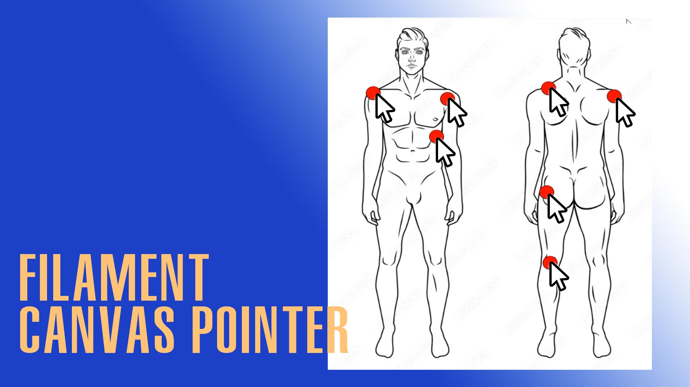

# A Filament field that allows users to click and point to mark references on an image.

[](https://packagist.org/packages/ruelluna/canvas-pointer)
[](https://github.com/ruelluna/canvas-pointer/actions?query=workflow%3Arun-tests+branch%3Amain)
[](https://github.com/ruelluna/canvas-pointer/actions?query=workflow%3A"Fix+PHP+code+styling"+branch%3Amain)
[](https://packagist.org/packages/ruelluna/canvas-pointer)




I have used it for a client that needs visual reprensentations to where the pains are located in the body. What is your use case? This field will produce a base-64 image. If you're saving this to your table, I recommend making a `BLOB` column or convert it to an actual image file.

## Installation

You can install the package via composer:

```bash
composer require ruelluna/canvas-pointer
```


## Usage

```php
CanvasPointerField::make('body-points')
    ->pointRadius(15) // default is 5
    ->imageUrl('your image source')
    ->width(800) // required
    ->height(800) // required
    ->label('Select body parts that are in pain'),
```

## Todos
- [ ] Automatically detect height and width
- [ ] Table Column Component
- [ ] Entry Component
- [ ] `npm` Konva dependency


## Changelog

Please see [CHANGELOG](CHANGELOG.md) for more information on what has changed recently.

## Contributing

Please see [CONTRIBUTING](.github/CONTRIBUTING.md) for details.

## Security Vulnerabilities

Please review [our security policy](../../security/policy) on how to report security vulnerabilities.

## Credits

- [Ruel Luna](https://github.com/ruelluna)
- [All Contributors](../../contributors)

## License

The MIT License (MIT). Please see [License File](LICENSE.md) for more information.
